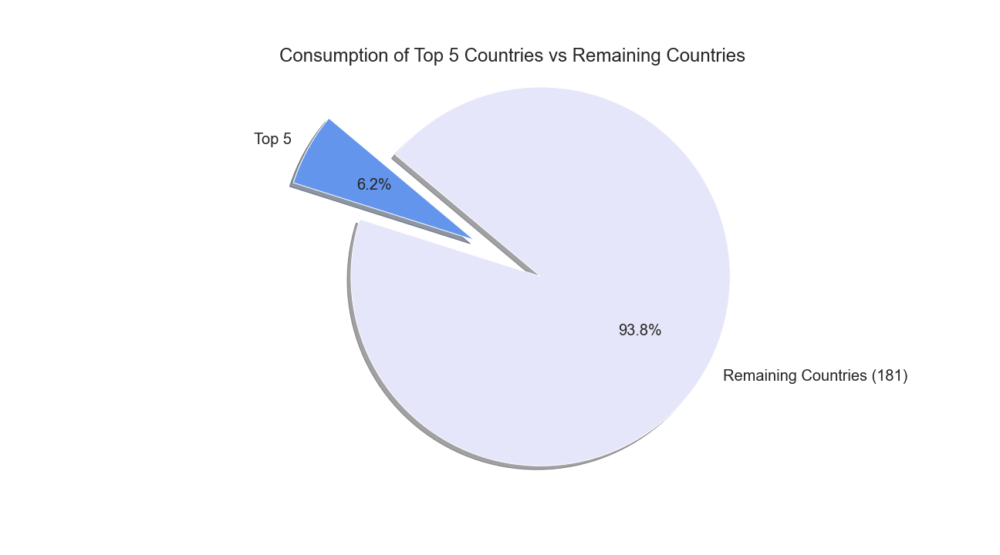

# data-analysis-project-1
#### First large data analysis class project

## Worldwide Alcohol Consumption Analysis 
Project link : 

### Motivation

The earliest records of alcohol brewing date more than 8000 years ago. There is an emerging view among evolutinary biologists that early departures from hunter/gatherer society can be directly attributed to the production of fermented beverages. Interestingly, while alcohol may have contributed to the genesis of civilization, it has simultaneously been villifed as an indicator of moral failing among many religious and cultural groups. Health and safety policies surrounding alcohol abound and have the potential to influence society greatly. Consequently, we looked to examine alcohol data.  

Our first project involved analyzing large pieces of data from 12 CSVs to get correlation statistics between different socio-econimic factors and alcohol consumption in general and wine consumption in particular. We were interested to see if wine consumption correlates with longer life expectancy. There is definitely more to look into, but what we have found so far is that life expectancy and wine drinking only have a low uphill correlation (both worldwide and in Europe - the highest wine drinking continent!). But both wine drinking and life expectancy are really highly correlated with country's GDP. So the most fitting conclusion with our reserach so far is to say that the higher the GDP of your country, the more likely you are to both live longer and drink wine.

### Tasks Involved
I. Corpus Collection
API calls were made to Open Weather and Google. We also collected data from 'World Health Organization,' 'Our World in Data,' and Kaggle. 

II. Pre-processing and Data Normalization
Nine lists(csvs) were merged to create our dataset with information for 186 countries:
	
* Continent/Geographic region
* Climate 
* Exports 
* Major Industry 
* Alcohol consumption 
* Mental Health 
* Life expectancy 
* Happiness Index 
* Country Capitals
* Wine Productions
* Consumption By Alcohol/Type
* Wine Consumption
    
Preprocessing the dataset involved an iterative series of tasks like removing Nans, renaming columns for consistency, deleting extraneous columns and searching/removing duplicates. 

III. Analysis and visualization
Visualizations were built using variety of Python libraries like Matplolib and Seaborn.

### Output

### Analysis 

1. When alcohol consumption is divided by continent, there is clear visual representation showing that countries in Europe are consuming more alcohol than the countries in the rest of the continents. According to the box plot, the median consumption for Europe is around 11L per capita, while in North America (2nd in alcohol consumption after Europe) it it around 7L per capita. Pie charts showing Europe’s consumption as a percentage of total worldwide consumption demonstrate a similar correlation.

2. A box plot on wine consumption per continent shows that Europe is drinking a lot more wine per capita than the rest of the continents, which correlates with the fact that Europe is consuming more alcohol than the rest of the continents overall. That argument is also proved by the pie charts showing Europe’s wine consumption total as a percentage of a total wine consumption as well as Europe’s average wine consumption compared to the rest of the continents. Further analysis that we have done also shows that Europe is consuming a lot more wine out of total alcohol consumption compared to the rest of the continents. European countries consume 27% wine out of total alcohol consumption, while other continents range from 2.7% to 19.9%.

4. From our correlation between Alcohol and Wine Consumption per capita worldwide and such markers as Happiness Score, Life Expectancy, GDP per capita and Mental Health Disorders, we can not draw very clear conclusion that alcohol consumption or wine consumption is an important factor in those markers. It correlates the least with the mental health disorder category with an rvalue of 0.0077. Out of all the markers Alcohol consumption and GDP seem to correlate the most , but still only shows a weak uphill linear relationship at rvalue of 0.205. 

5. When the markers for Happiness Score, Life Expectancy, GDP and Mental Health Disorders are demonstrated by continent in a box plot, one can easily see that Europe is higher in Life Expectancy and GDP than the rest of the continents despite the fact that it is also the continent with the highest alcohol consumption overall (that conclusion is made after we disregard the visual representation of Oceania on the box plots as the final data frame only contains two data points for that continent). Based on that observation we decided to look further into the data for Europe.

6. Once we have separated European countries from the rest of the data frame, we ran linear regression analysis on each of the same markers that we considered for the world - Happiness Score, Life Expectancy, GDP per capita and Mental Health Disorders. We correlated those with Alcohol Consumption as well as Wine Consumption in Europe. From the comparison of the data for Europe and the world, one can see that wine consumption and life expectancy correlate at around rvalue of 0.3 both worldwide and in Europe. However, wine drinking worldwide is more correlated with Happiness Score and Higher GDP, than it is in Europe.

7. Since worldwide GDP seems to correlate with alcohol and wine consumption, albeit at a weak uphill linear relationship, it raised a question that correlation here may not mean causation. And higher GDP may actually be the reason for the populations’s higher consumption of alcohol overall and wine specifically, instead of vice versa. We further divided the world into GDP groups and ran analysis on each group. Since GDP groups containing countries with the GDP of 8 to 11 represent 94% of all the data points, we considered them the most statistically significant. The box plot generated show that countries with GDP of 11 consume the most alcohol and that disparity is even more visually pleasing in the box plot for wine consumption.

8. The benefits of drinking wine has been popularized for decades, however, we can not draw a clear conclusion that wine drinking is the cause for the longer life expectancy. What seems to be the best predictor of the longer life expectancy is the GDP of the country, confirming the fact that belonging to a certain socio-economic group is really what determines life expectancy the most rather than other factors including alcohol consumption in general and wine consumption specifically. 

### Limitations
* As we merged our datasets we had one list of values that was our North Star for how we approached the analysis - alcohol consumption (L). Focusing on alcohol consumption, that yielded data for 186 countries. 

* For data on GDP, Life Expectancy, Happiness score and Mental health disorders, the number of datapoints decreased from 186 to 141 rows/values (countries). The biggest reduction in data available was especially apparent in reference to the Oceania continent with data only available for Australia/New Zealanda. Due to limited sample size, the analysis from that particular continent cannot be considered statistically significant when taking into consideration GDP, Life expectancy, Happiness score and Mental health disorders.

* Data collections method may vary by country. Additionally, while consumption may be listed as nominal in certain muslim-dominated countries, there likely exists underground consumption that may not be reflected in the data.

* This was an exploratory analysis and as a continuation, it may be beneficial to look at other indicators like violent crime, religion, education etc. 

### Group Members
* Ryan Eccleston
* Alison Sadel
* Stephen Bretscher
* Nadia Richards
* Jean-Pierre Gilbert
    
### Declaration
The authors declare and solemnly affirm that this research has neither been funded by any political or religious groups nor are the authors in any way affiliated to any institutions with direct or indirect access to groups with biased interests. This research work has been carried out in the interests of technology and academics.

